# 基于机器学习的房价可视化系统的设计与实现

> 公开脱敏版：保留论文正文与技术插图；学校模板、页眉页脚、校徽、身份元数据不进入公开文件，含个人资料或凭据的截图已隐藏。

目  录

## 绪论

研究背景和意义

当前，北京作为中国的首都和国家中心城市，其房地产市场一直备受广泛关注。随着城市化进程的加速和居民生活水平的提高，购房成为许多家庭的一项重要决策。然而，北京的房价波动巨大，市场信息复杂多变，给购房者带来了巨大的决策压力。在这一背景下，对北京房价进行深入研究并利用机器学习技术进行分析具有重要的现实意义。

首先，北京房价的高低直接关系到居民的居住成本和生活质量。深入了解北京房价的动态变化和市场特征，有助于政府更好地引导楼市发展，制定合理的调控政策，以维护市场的稳定和居民的切实利益。

其次，通过机器学习技术对大量的二手房数据进行分析，可以挖掘出市场中的潜在规律和趋势。这不仅对购房者提供了全面的市场认知，有助于他们做出明智的购房决策，同时也为开发商、投资者等市场参与者提供了有力的市场洞察，提高了市场的效率和透明度。

此外，通过可视化分析和聚类算法，可以更好地呈现数据的内在结构，使得复杂的信息更易于理解。这种对数据的深入挖掘，有助于揭示不同地区、不同类型房源之间的差异，为购房者提供更加具体、个性化的购房建议。

综上所述，本研究旨在通过机器学习技术，以北京房价为切入点，深入分析市场特征，为政府、购房者及其他市场参与者提供全面的市场信息，以推动北京房地产市场的健康发展，提升居民的居住体验，促进城市的可持续发展。

国内外研究现状

国内学者对大数据分析都有着众多研究，2023年陈小亮,程硕,陈衎使用机器学习方法对房价影响因素进行了分析，得知一线城市中影响房价的因素主要在于房子所处的地区，并且他们的机器学习算法理念非常先进，旨在帮助相关领域学者了解其研究热点和发展方向，为未来进一步的拓展研究提供理论支持和参考[1]。2023年曾静,廖书真.基于Python的河源二手房数据爬取及分析著作中，实现基于流计算和大数据平台的实时交通流预测[2]，2023年马腾,余粟.基于Python爬虫的二手房信息数据可视化分析中使用Python爬取了我国所有二手房的数据，推动了数据化分析的浪潮[3]，2023年张玉叶,李霞.基于Pandas+Matplotlib的数据分析及可视化著作中，简述了如何使用Python进行数据分析[4]，2021年王彦雅.基于Python的廊坊市二手房数据爬取及分析中，阐述了如何使用Python进行房价分析，提出了十分现金的理念[5]，2021年刘影.基于Python的房价数据爬取及可视化分析中讲述了Python在数据爬取与分析中的优点[6]，2021年黄文川.多算法模型的房价预测应用为我们展示了算法模型在房价分析中的重要地位，分析了现阶段算法模型的不足[7]，2021年戴瑗,郑传行.基于Python的南京二手房数据爬取及分析展示了如何使用Python与KMS算法对南京二手房价进行分析，详细的阐述了分析的过程[8]，2021年马志芹也发表了旅游景区作为劳动密集型企业，是旅游产品供给的重要窗口，其人力成本占据景区整体运营成本的较大比重。在大数据背景下，文章通过对多元化平台上的人力成本结构数据进行综合分析，结合南京市旅游景区的实证调查，对南京市旅游景区人力成本结构现状展开了研究。研究发现南京市旅游景区在运营过程中存在人力成本较低、差异大、岗位层次少等问题，并针对性地提出了优化策略建议，以期为南京市旅游景区的高效发展提供助力[9]，2020年段锐主要通过自然语言处理技术对文本进行分析，深度学习技术逐渐应用于图片和视频数据分析领域；工具上，主要使用带有图形用户界面的数据分析软件进行分析以及通过编程调用平台或模块开展研究[10]。

国外方面，Jing Qin于2021年在基于大数据算法，对SVM模型进行了详细描述，利用GWO算法优化了SVM的算法流程，构建了GWO-SVM分类模型。将GWO-SVM用于旅游景区规划开发的形象感知数据挖掘分析，并以某城市旅游景区为例，挖掘了影响形象感知的三个因素，即形象感知属性、情感形象和探索变量[11]。Li Jing 通过查阅、归纳、分析大量关于旅游消费行为、旅游大数据、文本数据分析等方面的相关文献研究，构建了旅游消费的研究思路框架。利用火车浏览器、NLPIR等软件对旅游样本数据进行抓取、预处理和挖掘，采用词频分析、共现分析、内容分析、情感分析、网络分析等方法对游客的特征和决策行为进行分析。根据行为分析结果，从改革和推进旅游营销策略、提高旅游产品和服务质量、改进旅游目的地管理方法三个方面提出了旅游发展策略[12]。Su Aihua在2022年提出国家旅游业竞争十分激烈。大数据的出现为旅游业的发展提供了新的机遇。旅游业利用数据挖掘和云计算技术，从海量信息中筛选出有价值的数据[13]。

研究内容

本研究的主要目标是通过机器学习技术深入分析北京房地产市场，为购房者提供全面的市场认知和决策支持。具体而言，主要包括以下几个方面的研究内容：

网络爬虫数据采集与清洗： 运用Python中的Requests和Beautifulsoup库，搭建网络爬虫系统，从链家网上收集所有北京二手房的房源数据。随后，对采集到的数据进行清洗，确保数据的准确性和可用性。

数据分析与可视化： 运用Python中的Numpy、Matplotlib和Pandas等数据分析工具，对清洗后的数据进行深入分析。通过可视化手段，揭示大量数据中隐藏的规律和趋势，为后续研究提供基础。

聚类分析与房源分类： 引入k-means聚类算法，对所有二手房数据进行聚类分析。通过聚类的结果，将二手房源大致分类，以形成对所有数据的概括总结。这一步骤有助于深入理解不同房源之间的相似性和差异性。

地理信息展示与高德地图集成： 结合高德地图开发者应用JS API，将聚类分析的结果以地理信息的形式展示。这使得购房者可以直观地了解不同区域的房源分布情况，为地理位置因素对房价的影响提供更清晰的认知。

综合分析与决策支持： 结合以上各个步骤的研究结果，综合分析北京房地产市场的基本特征、规律和趋势。通过机器学习技术的支持，为购房者提供更全面、深入的市场认知，为他们的购房决策提供科学、合理的支持。

通过这些主要研究内容，本研究旨在为购房者、政府和市场参与者提供一种全新的视角，帮助他们更好地理解和参与北京房地产市场，提高市场的透明度和决策的科学性。

章节内容安排

## 第一章为概述章节，主要介绍本系统的选题背景与国内外发展现状；

## 第二章为关键技术介绍章节，主要介绍Python开发语言，网络爬虫技术，数据分析技术；

## 第三章为系统需求分析章节，通过用例图的形式展现本系统所需要实现的功能；

## 第四章为系统设计章节，对系统的关键功能：数据采集，数据分析，聚类分析等进行业务逻辑，业务流程设计；

## 第五章为实现章节，阐述本系统如何使用Python开发语言，HTML，Numpy等技术实现数据采集，数据分析，机器学习等功能；

## 第六章为系统测试章节，主要采用黑盒测试方法对系统的数据分析，数据采集功能进行测试，保证系统的稳定性。

## 关键技术介绍

网络爬虫技术

网络爬虫技术是通过模拟浏览器行为，使用Requests库向链家网发送HTTP请求，获取北京二手房的房源数据。Beautifulsoup库被应用于解析HTML页面，从中提取所需信息，构建了一个高效而灵活的数据采集系统。

Requests

Requests 是一个强大而简洁的HTTP库，用于发送HTTP请求。在本系统中，Requests 用于模拟浏览器向链家网发送请求，获取北京二手房的房源数据。其简单易用的接口和丰富的功能使得数据的获取过程更为高效。

Beautifulsoup

Beautifulsoup 是一个用于从HTML或XML中提取数据的库，它能够将网页解析成树形结构，方便开发者提取所需信息。在本系统中，Beautifulsoup 用于解析链家网上的HTML页面，从中提取出二手房源数据，为后续的数据处理奠定基础。

数据分析

数据分析技术基于Python的核心库，包括Numpy、Matplotlib和Pandas。Numpy提供了高性能的数组对象，支持对房源数据的快速处理。Matplotlib用于绘制直观的数据可视化图表，而Pandas则负责清洗、整理和结构化数据，为后续分析提供有序数据集。

Numpy

Numpy 是Python中用于科学计算的核心库，提供了高性能的多维数组对象。在本系统中，Numpy 用于处理和操作二手房源数据，例如数据的清洗和转换。其强大的数学运算功能使得数据处理更为便捷。

Matplotlib

Matplotlib 是Python中用于绘制图表和数据可视化的库。在本系统中，Matplotlib 用于可视化分析，将清洗后的数据以图表形式展示，帮助研究者更好地理解数据的分布和趋势。

Pandas

Pandas 是Python中用于数据分析的重要库，提供了灵活的数据结构和数据分析工具。在本系统中，Pandas 用于清洗、整理和处理采集到的房源数据，为后续的聚类分析和可视化提供整齐有序的数据结构。

k-means聚类算法

k-means 是一种常用的聚类分析算法，它将数据集分为 k 个簇，使得同一簇内的数据点相似度较高。在本系统中，k-means 被应用于对所有二手房数据的聚类分析，通过将房源划分为不同的簇，研究者可以更好地理解房源之间的相似性和差异性。

k-means聚类算法是一种强大的数据分析工具，被应用于对所有二手房数据的聚类分析。通过将房源划分为不同簇，揭示了房源之间的相似性和差异性，为系统提供了更深入的市场洞察。

Web系统技术

HTML

HTML（Hypertext Markup Language）是一种用于创建和设计网页的标记语言。它由一系列标签组成，每个标签都有特定的含义和功能，用于定义文档结构、内容和样式。HTML作为网页的基础语言，负责描述文档的结构，并通过标签将各个元素组织起来，使其在浏览器中正确显示。

在本系统中，HTML技术被用于展示通过数据分析获得的图表和可视化结果。通过Matplotlib等库生成的图表可以以HTML形式嵌入网页中，为用户提供直观的数据呈现。通过HTML的图像标签（），可以将分析得到的图片插入到网页中，使得用户能够轻松浏览、比较和分析图表，为购房者提供更清晰的市场信息。

通过HTML的灵活性，系统能够生成动态而交互性的报告页面，使得研究者和购房者可以更直观地理解和利用通过数据分析获得的结果。这种结合HTML技术的图表展示方式为系统的可视化分析提供了更广泛的应用和用户交互性。

Django

Django 是一个高级的 Python 网络框架，可以快速开发安全和可维护的网站1. 它是免费和开源的，有活跃繁荣的社区，丰富的文档，以及很多免费和付费的解决方案1. Django 可以使你的应用具有以下优点：完备性、通用性、安全性、可扩展性、可维护性和灵活性1. 通过使用 Django，Python 的程序开发人员可以轻松地完成一个正式网站所需要的大部分内容，并进一步开发出全功能的 Web 服务。

## 系统分析

可行性分析

技术可行性：本系统采用Python作为主要开发语言，结合网络爬虫技术、数据分析库（Numpy、Matplotlib、Pandas）、以及聚类算法（k-means）等先进技术。这些技术成熟、应用广泛，Python生态系统强大，为系统提供了高效而可靠的开发基础。通过HTML技术，系统还能够以直观、交互的方式呈现分析结果，提高用户体验。技术的成熟和可靠性为系统的顺利开发和稳定运行提供了坚实的基础。

经济可行性：本系统采用开源的Python语言和相关库，降低了开发成本。网络爬虫和数据分析等技术在业界广泛应用，拥有大量相关资源和社区支持，减少了系统开发和维护的经济负担。系统的投资主要集中在研究者的技术培训、服务器维护和数据存储上，相对来说是可控的。考虑到系统的价值和应用潜力，经济可行性较高。

法律可行性：本系统在数据采集阶段采用了链家网上公开的二手房数据，遵循了信息获取的合法途径。系统的开发和使用过程中需遵守相关法规和隐私保护政策，确保用户数据的安全和合法性。由于系统并未涉及侵犯他人权益的行为，符合法律法规的要求。在开发和使用过程中，将严格遵循相关法律规定，保障系统的合法性和用户隐私权。

综上所述，本系统在技术上有着稳健的基础，经济上具备成本可控和投资回报的潜力，法律上符合相关法规和隐私保护政策，因而呈现出全面而有利的可行性，为进一步研究和实施提供了有力的支持。

系统需求分析

业务需求分析

本系统的主要业务流程分为数据采集、目标数据规划、数据清洗、可视化分析展示以及数据聚类分析，最终将结果呈现在HTML页面中。

本系统能够全面分析北京二手房市场数据，提供直观的结果展示，为购房者和市场参与者提供有力的决策支持，因此本系统的用例图如图3-1所示。

图3-1 用例图

数据采集用例中，主要由两类用例组成：目标数据规划与数据清洗，目标数据规划主要判断链家网的信息，然后根据系统本身的业务，确定自身需要采集的数据，需要对数据进行预处理，把一些缺失值，缺失符号的数据清理掉，清理后的数据才能进行后续的分析，用例如表3-1所示。

表3-1 数据采集

<table>
<tr><td>名称</td><td colspan="2">数据采集</td></tr>
<tr><td>概述</td><td colspan="2">采用爬虫程序，爬取链家网数据，并对爬取到的数据进行清洗操作</td></tr>
<tr><td>参与者</td><td colspan="2">爬虫程序</td></tr>
<tr><td>前置条件</td><td colspan="2">能链接互联网的PC主机</td></tr>
<tr><td>基本事件流</td><td>步骤</td><td>活动</td></tr>
<tr><td></td><td>1</td><td>启动爬虫程序</td></tr>
<tr><td></td><td>2</td><td>将爬取的数据存入csv文件中</td></tr>
<tr><td></td><td>4</td><td>爬取完成后，对数据进行清洗操作</td></tr>
<tr><td></td><td>5</td><td>将清洗的数据存入csv文件中</td></tr>
</table>

系统获取到干净的数据后，将对这些数据进行可视化分析，数据可视化分析可以帮助人们更好、更直观的认识数据，具体如表3-2所示。

表3-2 数据可视化分析

<table>
<tr><td>名称</td><td colspan="2">数据可视化分析</td></tr>
<tr><td>概述</td><td colspan="2">对数据从整体上做一个探索性分析并把数据进行可视化呈现</td></tr>
<tr><td>参与者</td><td colspan="2">Python程序</td></tr>
<tr><td>前置条件</td><td colspan="2">已经爬取并清洗好原数据</td></tr>
<tr><td>基本事件流</td><td>步骤</td><td>活动</td></tr>
<tr><td></td><td>1</td><td>数据加载</td></tr>
<tr><td></td><td>2</td><td>数据转换与运算</td></tr>
<tr><td></td><td>3</td><td>数据可视化呈现</td></tr>
</table>

数据聚类分析，k-Means算法是一种聚类算法，它是一种无监督学习算法，目的是将相似的对象归到同一个蔟中，对爬取的房价进行聚类分析，帮助用户更直观的查看房价走势，如表3-3所示。

表3-3 数据聚类分析

<table>
<tr><td>名称</td><td colspan="2">数据聚类分析</td></tr>
<tr><td>概述</td><td colspan="2">对所有数据进行机器学习，聚类分析</td></tr>
<tr><td>参与者</td><td colspan="2">Python程序</td></tr>
<tr><td>前置条件</td><td colspan="2">已经爬取并清洗好所有数据</td></tr>
<tr><td>基本事件流</td><td>步骤</td><td>活动</td></tr>
<tr><td></td><td>1</td><td>选定k值</td></tr>
<tr><td></td><td>2</td><td>创建k个点作为k个簇的起始质心</td></tr>
<tr><td></td><td>3</td><td>分别计算剩下的元素到k个簇中心的相异度（距离），将这些元素分别划归到相异度最低的簇</td></tr>
<tr><td></td><td>4</td><td>根据聚类结果，重新计算k个簇各自的中心，计算方法是取簇中所有元素各自维度的算术平均值。</td></tr>
<tr><td></td><td>5</td><td>将D中全部元素按照新的中心重新聚类</td></tr>
<tr><td></td><td>6</td><td>重复第5步，直到聚类结果不再变化，输出结果</td></tr>
</table>

结果展示，数据可视化分析与聚类分析都将输出结果图片，该用例使用HTML代码与CSS代码，将这些结果展示在Web页面上，方便分析员进行结果查看，具体如表3-4所示。

表 3-4结果展示

<table>
<tr><td>名称</td><td colspan="2">结果展示</td></tr>
<tr><td>概述</td><td colspan="2">使用HTML语言与CSS语言结合分析生成的图片，展示结果。</td></tr>
<tr><td>参与者</td><td colspan="2">浏览器与用户</td></tr>
<tr><td>前置条件</td><td colspan="2">上述所有用例全部完成</td></tr>
<tr><td>基本事件流</td><td>步骤</td><td>活动</td></tr>
<tr><td></td><td>1</td><td>打开结果展示的HTML</td></tr>
<tr><td></td><td>2</td><td>查看结果</td></tr>
</table>

非功能需求分析

性能需求：

实时性：确保系统能够及时反映最新数据，使用户能够即时获取市场动态。

可靠性和稳定性：

系统可靠性：系统应具备高可靠性，确保在各种环境下稳定运行，防止因系统故障导致数据丢失或错误。

稳定性：系统应保持稳定，能够处理大规模数据分析而不出现崩溃或异常。

安全性：

数据安全：数据存储在安全的环境环境中，并且数据分析完成后，需要有定时清理数据的机制。

可维护性：

代码可读性：系统代码应易于阅读，以便于后续维护和更新。

模块化设计：采用模块化设计，方便对系统进行部分功能的修改和扩展，以确保系统的长期可维护性。

本章小结

本章节主要对系统进行了用例分析，确定了系统的实现功能目标，确定了实现步骤。

## 系统设计

系统总体设计

通过上述的需求分析得知，本系统分为五大类：数据采集，数据分析，聚类分析，结果展示，后台数据管理，系统功能结构图如图4-1所示。

图4-1 系统功能结构图

功能设计

数据采集

数据采集功能由两个小功能组成：数据爬取与数据清洗，在数据爬取功能中，首先打开链家网，地址选择北京，确定爬取的目标数据。

然后从链家网上抓取北京市各区域的二手房信息，首先通过构建不同区域和页面的URL，使用网络爬虫技术下载页面内容，然后解析页面提取二手房详情页面的链接，随后，爬虫遍历这些链接，下载详情页面，解析页面获取二手房的具体信息，并最终将数据输出，为了防止被反爬虫机制封锁，采用简单的时间间隔暂停策略，HTML页面解析出的数据存入csv文件中，数据爬取流程图如图4-2所示。

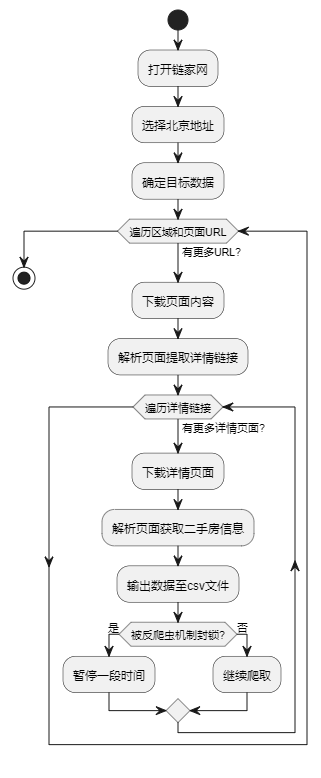

图4-2 爬虫流程图

使用 csv 模块读取名为 ershoufang-mini-utf8.csv 的CSV文件，将每行数据进行清理，去除每个数据项的空白符和换行符，将清理后的数据写入名为 ershoufang-mini-utf8.txt 的文本文件中，实现对数据的清理和整理，数据清理的过程包括对记录的数据项对齐，对总价数据项进行整数化，去除单价数据项的单位，去除建筑面积和套内面积数据项的单位，流程图如图4-3所示。

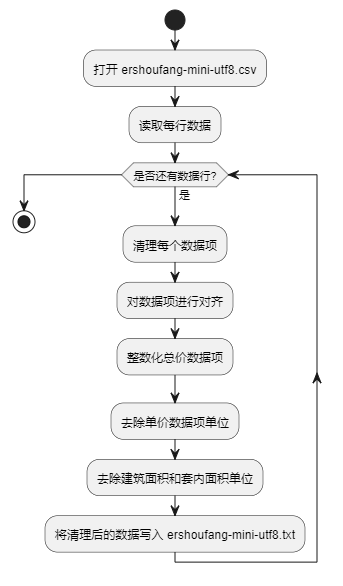

图4-3 数据清洗时序图

数据分析

数据分析是将文本数据以各种图形的方式展现出来，本系统数据分析模块分别为：高频词云图分析、房源数量折线图分析、房屋用途分析、二手房单价分析、二手房总价分析、单价排名分析、交易热力图分析、建筑面积分析、户型装修朝向分析，系统针对清洗后的数据，对这些数据进行以上这些模块的分析操作，来帮助用户只管了解当前北京二手房市场的走向。

热力图实现设计：首先获取小区经纬度信息：通过百度地图 API 实现，根据北京市各小区名称获取其经纬度信息。百度地图 API 的请求通过 HTTP GET 方法完成，传递小区名称等参数，并解析返回的 JSON 数据以提取经纬度。保存经纬度信息为 CSV 文件：将获取的小区经纬度信息保存为 CSV 文件。CSV 文件包含列：小区ID、小区名称、经度、纬度。读取清理后的二手房数据：读取已清理的二手房数据文件。合并经纬度信息到二手房数据：利用 Pandas 的 DataFrame 进行数据合并，将小区经纬度信息与二手房数据关联。筛选符合条件的二手房数据：根据条件筛选二手房数据，例如总价小于 400 万元、建筑面积小于 80 平方米等。将符合条件的二手房数据的经纬度信息输出到一个文本文件，输出格式为每行一个小区的经纬度信息，用逗号分隔，流程图如图4-4所示。

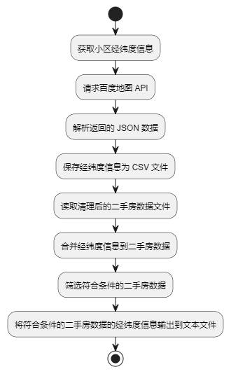

图4-4 热力图

词云图实现设计：首先进行数据文件读取：读取清理后的二手房数据文件中文本数据。配置词云基础参数：设置背景图片路径、保存词云图片路径、字体路径、停用词列表等。分词处理：使用分词算法对二手房数据进行分词。剔除停用词，例如 "null"、"暂无"、"数据" 等。设置词云格式：使用 WordCloud 类配置词云的各种参数，如字体、背景颜色、形状等。生成词云：利用配置好的 WordCloud 对象生成词云图。保存词云图：将生成的词云图保存为图片文件，流程图如图4-5所示。

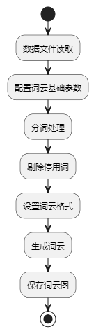

图4-5 词云图

其他分析设计过程与词云图与热力图一致，都是通过读取清洗后的csv文件，然后使用pandas或者numpy对数据进行排序，筛选，筛选出需要的数据，然后在使用matplotlib绘制各种可视化图形比如饼状图，柱状图，条形图等。

聚类分析

通过 loadDataset 函数加载二手房数据集，筛选所需字段，并转换成 numpy 数组。选择 K 值：使用 KMeansClassifier 类尝试不同的 K 值，计算每个 K 值对应的平方误差和（SSE）。绘制不同 K 值下的 SSE 折线图。聚类分析：选择合适的 K 值，运行 K-means 算法进行聚类。统计每个簇的均值结果，包括总价、单价、建筑面积，以及簇的样本数量。绘制散点图：绘制单价与建筑面积的散点图，每个簇使用不同颜色。绘制总价与建筑面积的散点图，每个簇使用不同颜色。生成地图文件：将聚类结果写入地图文件，包括经纬度和总价信息，流程图如图4-6所示。

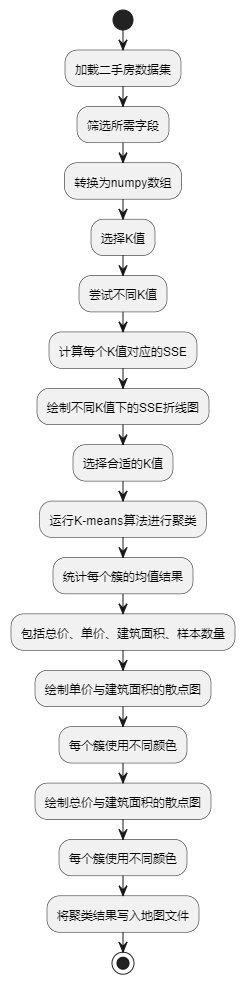

图4-6 聚类分析

可视化设计

通过使用 Django 构建 Web 服务，结合 HTML、CSS 和 JavaScript 技术，实现数据分析结果的可视化设计过程如下：用户通过浏览器访问系统的 URL，请求数据分析页面。Django 接收到用户的请求，并调用相应的视图函数进行处理。视图函数从数据源获取数据，并使用相应的数据分析工具进行处理和分析。处理完成后，生成相应的数据分析结果文件，如图片文件等。HTML 页面通过 JavaScript 代码读取数据分析结果文件，准备将其展示在页面上。CSS 样式表对读取到的数据分析结果进行排序和美化，以提升页面的可视化效果和用户体验。经过 HTML、JavaScript 和 CSS 处理后，数据分析结果以美观的方式展示在用户界面中，流程图如图4-7所示。

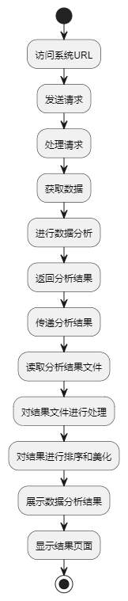

图4-7 可视化

## 系统实现

数据爬取

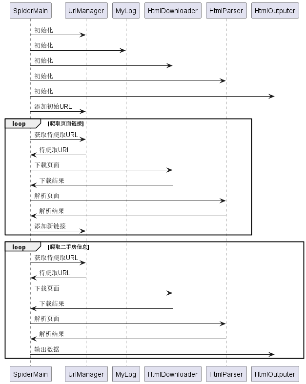

图5-1 爬虫时序图

数据爬取时序图如图5-1所示，首先观察北京链接二手房的数据查询结构，然后提前收集好所有的北京二手房区域数据，然后开始编写代码，爬虫代码其主要结构由 SpiderMain 类及相关工具类组成。

首先，在 SpiderMain 类的构造函数中，各个属性（UrlManager、MyLog、HtmlDownloader、HtmlParser 和 HtmlOutputer）被初始化。craw 方法是该爬虫的入口函数，分为两个主要阶段：第一阶段用于抓取所有二手房详情页面的链接，并将这些链接添加到 UrlManager 中；第二阶段则遍历 UrlManager 中的链接，逐一下载、解析页面，提取所需信息，最终将信息输出到 CSV 文件中。

UrlManager 类用于管理爬取页面的 URL，包括添加新的 URL (add_new_urls) 和检查是否有新 URL 可用 (has_new_url)。

HtmlDownloader 类实现页面下载功能，采用了随机选择 User-Agent 的方式，以增加爬虫的健壮性。

HtmlParser 类则负责解析页面，其中 get_ershoufang_data 方法用于解析二手房详情页面，提取所需信息；而 get_erhoufang_urls 方法用于解析二手房列表页面，提取二手房详情页面的链接。

HtmlOutputer 类用于收集爬取到的二手房信息，并将其输出到 CSV 文件中。

在程序入口部分，通过设定爬虫入口 URL，并初始化 SpiderMain 对象，最后启动爬虫。这个爬虫主要分为两个阶段，通过细致的异常处理和延时操作，旨在提高爬虫的稳定性，防范反爬虫机制的封禁。并且爬虫的所有过程都将通过MyLog类进行记录，保证爬取效果稳定与出现错误后的调试，爬虫结果如图5-2与图5-3所示。

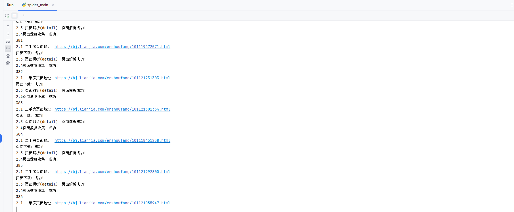

图5-2 爬虫结果

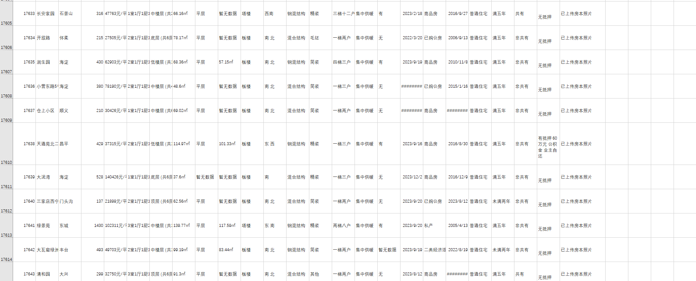

图5-3 爬虫结果2

数据清洗

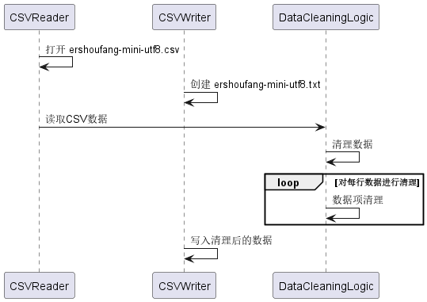

图5-4 数据清洗时序图

清洗时序图如图5-4所示，首先，通过csv.reader读取指定文件: ershoufang.csv中的二手房数据，将每一行数据存储在context列表中。利用列表推导式对每一行的数据项进行处理，使用strip()方法去除每个数据项的空白符和换行符。如果数据的第一个字段是 "id"，直接将该行写入新的文本文件。针对特殊情况，例如存在"别墅"或"商业办公类"的记录，对相关数据项进行对齐或正则表达式匹配，以规范数据。对于 "车库" 的记录，同样进行对齐操作。将整理后的数据写入新的文本文件: ershoufang-clean-utf8-v1.1.csv并进行一些额外的处理：将总价数据项统一整理为整数。去除单价数据项的单位。去除建筑面积和套内面积数据项的单位。在数据项转换失败时，捕获异常并输出相应的提示信息，但仍然继续处理下一条记录，清洗结果如图5-5所示，数据经过清洗后，系统自动排除了不被需要的数据。

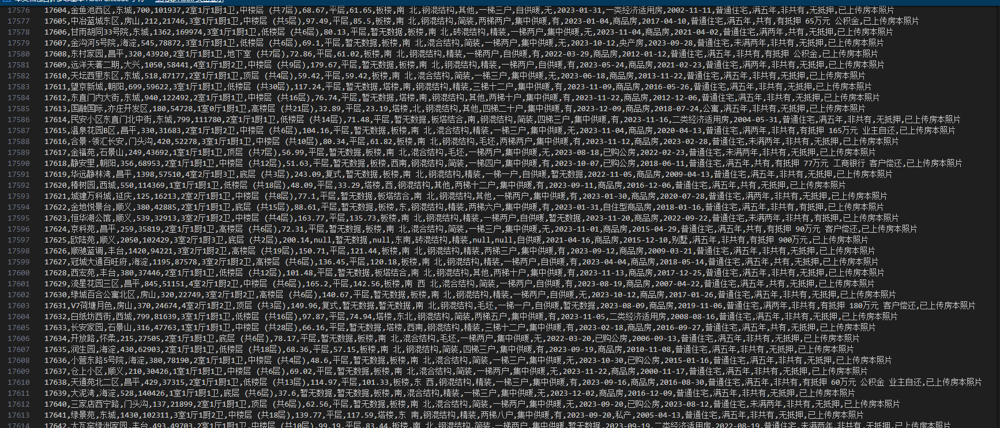

图5-5 清洗结果

数据分析

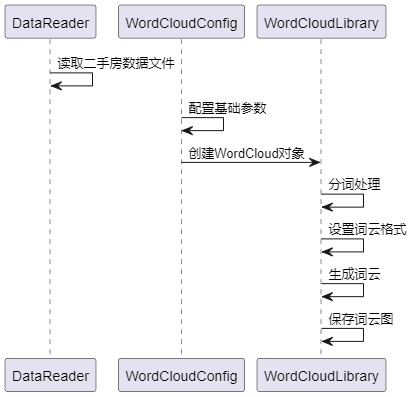

图5-6 词云图时序图

词云图时序图如图5-6所示，实现过程：读取北京二手房数据文件（CSV格式）；读取背景图片，作为词云的形状；使用 jieba 进行中文分词，并剔除停用词；将分词结果拼接为字符串。使用 WordCloud 类配置词云的字体、背景颜色、形状等参数；生成词云图，并保存为指定文件，并且在调用WordCloud的generate方法时候，对分词的结果进行统计，显示了频繁出现的词汇，为数据的关键信息提供了直观的可视化呈现，分析结果如图5-7所示，其中五年，抵押，供暖，住宅类型等频繁出现，可以看出现在北京二手房市场的稳定，并且市场趋向于住而不是消费。

图5-7 词云统计分析

首先，通过 pandas 读取并加载了清理后的数据集，然后使用 value_counts 统计了二手房不同用途的数量。接着，利用 matplotlib.pyplot 创建水平柱状图，展示了各种房屋用途的数量分布。最后，通过 savefig 将生成的水平柱状图保存到指定文件夹，通过分析的结果可以得知，北京二手房市场突出于住而不是投资消费，这与词云分析的结果一致，二手房用途分析柱状图结果如图5-8所示。

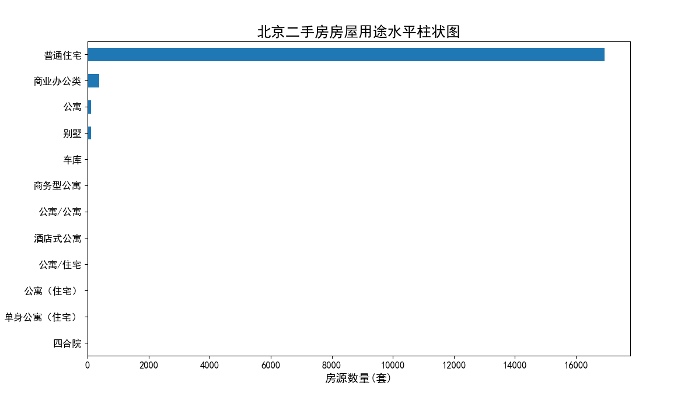

图5-8 二手房用途柱状图

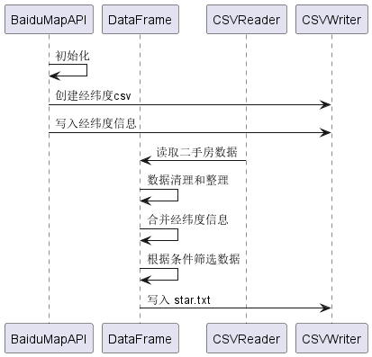

图5-9 热力图

热力图时序图如图5-9所示，实现过程，热力图的实现需要使用到百度地图的API，首先在getlnglat函数使用百度地图API获取每个小区名称对应的经纬度信息。遍历数据集中的小区信息，调用API获得经纬度，将结果保存到latlng.csv文件。读取latlng.csv文件，将经纬度信息与原始数据集进行合并，依据列名id，对合并后的数据进行筛选，选择房价小于400万且建筑面积小于80平方米的二手房数据，将筛选后的经纬度信息以指定格式写入js文件，然后编写好热力图的HTML文件，并引入js文件，根据百度官方文档，实现总价小于400万的二手房热力数据，可以看出北京各个区的小户型刚需房的分布情况，然后在写入所有未筛选的价格，实现总价热力图，结果如图5-10与图5-11所示。

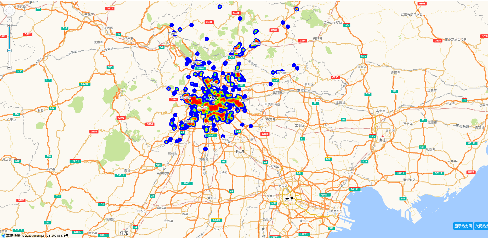

图5-10 小于400万热力图

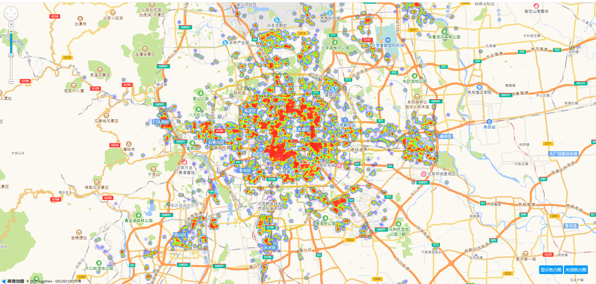

图5-11 总价热力图

房屋情况分析实现过程：通过 Pandas 库读取名为 "ershoufang-clean-utf8-v1.1.csv" 的 CSV 文件，使用自定义的列名和处理缺失值，使用 Matplotlib 的 plot 函数，指定 kind="pie"，绘制饼图。使用颜色映射 cmap=plt.cm.rainbow 增添可视化效果。利用 autopct 参数显示百分比标签。条形图绘制：使用 Matplotlib 的 plot 函数，指定 kind="bar"，绘制条形图。通过调整图形的大小和添加合适的标题，提高可读性。水平条形图绘制：使用 Matplotlib 的 plot 函数，指定 kind="barh"，绘制水平条形图。通过调整图形的大小和添加合适的标题，提高可读性。使用 Matplotlib 的 savefig 函数，将绘制好的图形保存为图片文件。这些可视化结果展示了北京二手房数据中关于户型、装修、建筑类型、房屋朝向和建筑面积的分布情况，通过分析结果得知2室1厅的精装房屋，在北京二手房市场中最为流行，代表这种类型的房屋受到买房者的热爱，分析结果如图5-12所示。

图5-12 房屋情况分析

北京二手房价格分析实现过程：使用 Pandas 库的 read_csv 函数加载名为 ershoufang-clean-utf8-v1.1.csv 的 CSV 文件。通过 skiprows 参数跳过头行，通过 names 参数指定列名，通过 na_values 参数处理缺失值标记为 "null" 和 "暂无数据"，然后进行一系列价格数据的筛选：北京各区域二手房平均单价：将数据按区域分组，计算平均单价，然后绘制柱状图。保存生成的图形为 "北京各区域二手房平均单价.png"。北京各区域二手房单价箱线图：将数据按区域分组，绘制箱线图，展示单价的分布情况。保存生成的图形为 "北京各区域二手房单价箱线图.png"。北京各区域二手房总价箱线图：将数据按区域分组，绘制箱线图，展示总价的分布情况。保存生成的图形为 "北京各区域二手房总价箱线图.png"。北京各区域二手房平均建筑面积：将数据按区域分组，计算平均建筑面积，然后绘制柱状图。保存生成的图形为 "北京各区域二手房平均建筑面积.png"。北京各区域平均单价和平均建筑面积：将数据按区域分组，计算平均单价和平均建筑面积，然后绘制两个子图。保存生成的图形为 "北京各区域平均单价和平均建筑面积.png"。北京各区域二手房房源数量：将数据按区域分组，计算各区域的二手房房源数量，然后绘制折线图。保存生成的图形为 "北京各区域二手房房源数量.png"。北京二手房单价最高Top20：按照单价从高到低排序，选择前20个小区，绘制横向柱状图。保存生成的图形为 "北京二手房单价最高Top20.png"。北京二手房总价与建筑面积散点图：绘制散点图，展示总价与建筑面积的关系。保存生成的图形为 "北京二手房总价与建筑面积散点图.png"。北京二手房单价与建筑面积散点图：绘制散点图，展示单价与建筑面积的关系。保存生成的图形为 "北京二手房单价与建筑面积散点图.png"，结果如图5-13所示，可以通过此结果了解北京二手房市场的价格区间分布，价格与面积，地区之间的联系，帮助购房用户或者市场进行细微调整。

图5-13 房价分析

聚类分析

通过loadDataset函数，读取清洗好的csv文件，并合并经纬度数据，剔除空值和一些离群点，将数据转换为NumPy数组，然后选择合适的聚类数量（k值），通过计算不同k值下的SSE，然后绘制SSE和k值的折线图，帮助选择最合适的k值，在根据选择的k值之前选择的k值进行K-means聚类，并获取聚类结果，统计每个簇的均值，然后创建了一个包含每个簇数据的DataFrame，并将这些数据存储在data_result、result_mean和data_df中，使用Matplotlib绘制了两张散点图，分别展示了单价与建筑面积的关系和总价与建筑面积的关系然后，生成了多个地图文件，每个文件对应一个簇，用于在地图上可视化展示聚类结果。结果如图5-14至图5-19所示。

图5-14 聚类结果统计

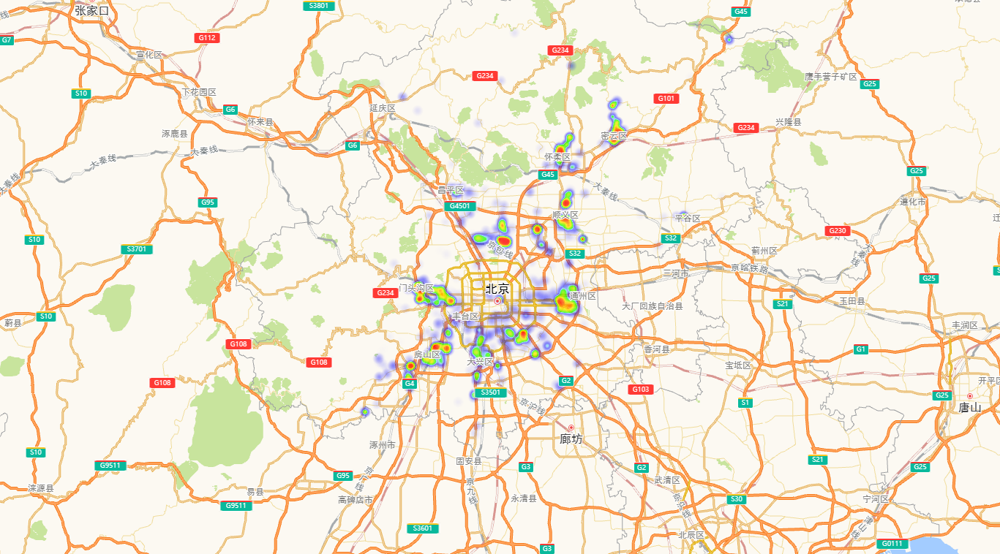

图5-15 聚类结果区域分布0

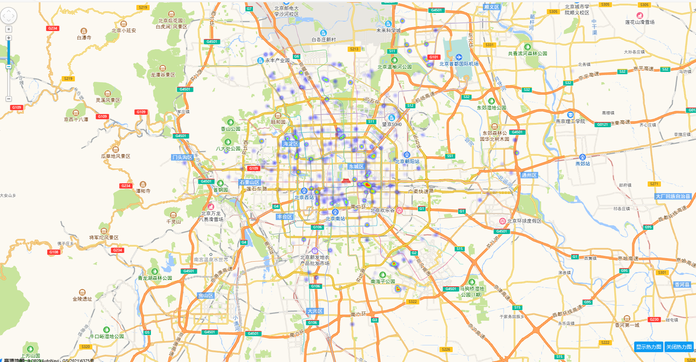

图5-16 聚类结果区域分布1

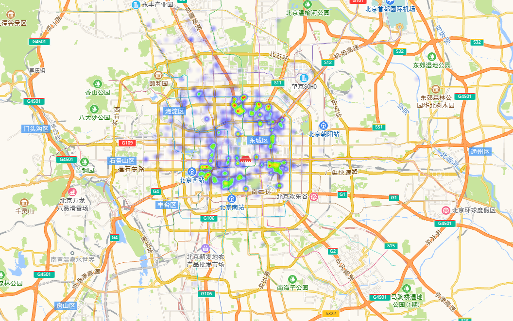

图5-17 聚类结果区域分布2

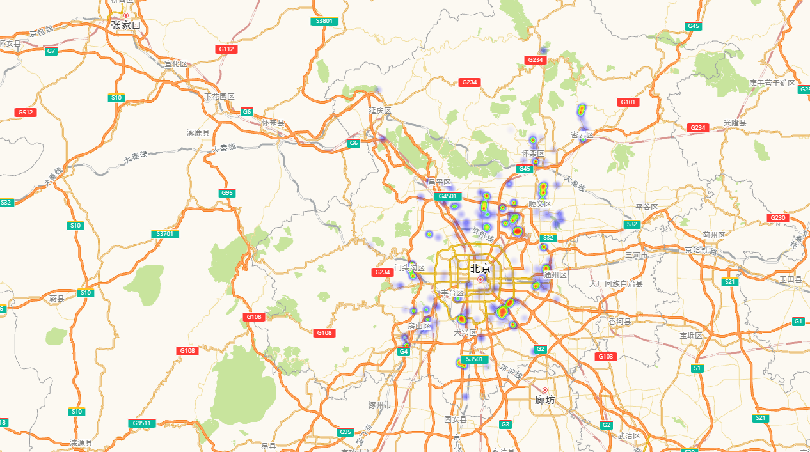

图5-18 聚类结果区域分布3

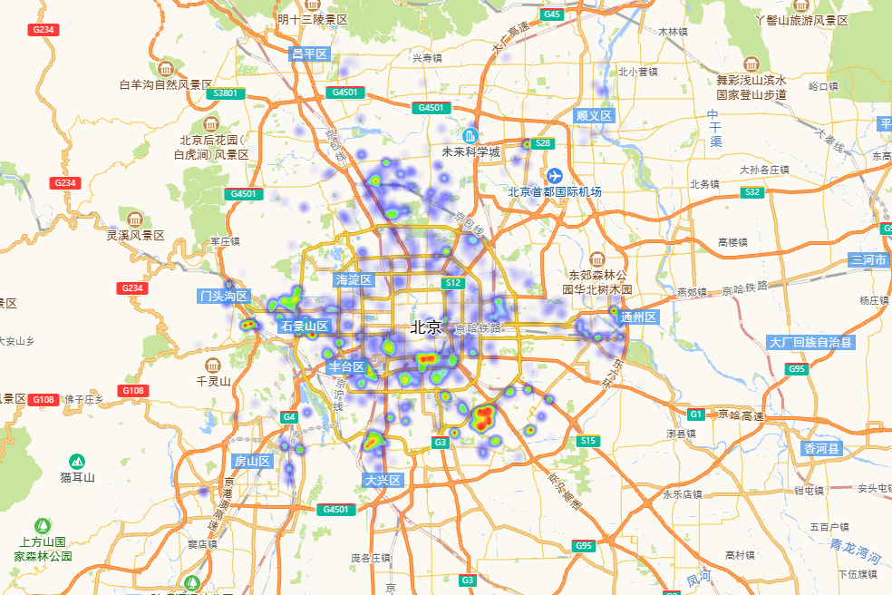

图5-19 聚类结果区域分布4

根据聚类结果和我们的经验分析，我们大致可以将这18000多套房源分为以下4类：

a、大户型（面积大，总价高），属于第3类。平均面积都在200平以上，这种大户型的房源相对数量较少，主要分布在延庆余、通义、昌平等地（具体可从各类中的区域分布图可知）。

b、地段型（单价高），属于第2，1类。这种房源围绕北京市中心位置集中分布，地理位置极好，交通方便，主要分布海淀、朝阳，东城，西城。

c、大众蜗居型（面积小、价格相对较低、房源多），属于第4类。这类房源分布范围广，主要围绕在各地铁线两边。

d、高性价比型（面积相对大，单价低，总价低），属于第0类。典型的区域为大兴，房山，通州，顺义等地。

结果展示

使用HTML语言与上述步骤生成的图片与热力图，将结果整合在一起，用户可以通过此HTML进行分析结果的查询。

图5-20 房屋分析

房屋分析结果如图5-20所示，通过分析结果可以看出只有少数几种的朝向比较多，其余的都非常少，明显属于长尾分布类型（严重偏态）。这也符合我们的认识，房屋朝向一半都是坐北朝南。房源的建筑类型65.6%都是板楼，现在房地产商喜欢开发的塔楼反而较少，这和北京二手房建筑时间有关都比较久远相符。2室1厅与2室2厅作为标准配置，一起占比接近一半。其中3室2厅和3室1厅的房源也占比不少，其他房屋户型的房源占比就比较少了，房源全部为二手房的缘故，近60%的房源的房屋装修情况都是写的其他，大家都是自主装修过的。建筑面积50~100区间内房源数量最多，超过了8000套。其次是100~150区间与小于50的区间，并且东城，大兴，丰台，房山这几个区二手房数量剧增，可能因为离北京主城区比较远，成为了大多数北漂的选择。

其他结果如图5-21所示，主要就是热力图，通过此图可以看出北京市三环是二手房市场交易主力，也可以侧面分析出大部分群众喜欢在市区三环路附近居住。

图5-21 其他结果

后台数据管理

后台使用Django框架搭建，然后结合simpleui，搭建后台管理视图，首先创建数据库表house，表中存放的是爬取的北京市二手房价数据，然后在项目中定义好模型models py中定义好数据库的模型，并在admin py文件中，将定义好的数据库模型注册到Django中，并写好list_display与search_fields类，方便后台界面展示该表中的字段与查询参数，然后在控制台输入命令：python manage.py makemigrations与python manage.py migrate，执行Django Admin模块，在输入python manage.py createsuperuser创建初始用户，然后执行项目，并在浏览器中输入127.0.0.1：8080，进行后台登录，然后选择house菜单，即可进行房屋数据的管理，维护系统整体数据的健壮，界面如图5-23所示。

图5-23 后台数据管理

## 系统测试

测试方法与环境

系统测试环境为Windows11，Python3.7，编译器为Pycharm。

系统测试方法为黑盒测试方法，主要对系统的数据爬取，可视化分析功能进行测试，保证系统流程运行。

功能测试

爬虫测试用例中，主要测试系统是否正确绕过链家的反爬机制，是否如设定号的爬虫代码，爬取到了链家网的房价数据，并存入到执行的csv文件中，具体用例如表6-1所示。

表6-1 爬虫测试用例表

<table>
<tr><td>名称</td><td colspan="3">爬虫测试用例表</td></tr>
<tr><td>概述</td><td colspan="3">是否可以正常爬取数据 是否有报错处理机制 是否可以将数据存入CSV文件中 是否为多线程爬取</td></tr>
<tr><td>步骤</td><td>步骤</td><td colspan="2">步骤与预期结果</td></tr>
<tr><td></td><td>1</td><td colspan="2">启动爬虫脚本，爬取链家网北京房价地区数据</td></tr>
<tr><td></td><td>2</td><td colspan="2">通过地区数据，爬取房价数据与房子详细数据</td></tr>
<tr><td></td><td>3</td><td colspan="2">存入CSV文件</td></tr>
<tr><td colspan="4">测试结果</td></tr>
<tr><td>结果</td><td>1a</td><td>成功获取到北京地区数据</td><td>通过</td></tr>
<tr><td></td><td>2a</td><td>成功获取到房价数据与房子详细数据</td><td>通过</td></tr>
<tr><td></td><td>3a</td><td>成功存入了CSV文件</td><td>通过</td></tr>
<tr><td></td><td>4a</td><td>观察计算机CPU值变化，是多线程爬取</td><td>通过</td></tr>
</table>

数据分析测试用例如表6-2所示，主要进行了数据清洗测试，各种分析图生成测试比如词云图等。

表6-2 数据分析

<table>
<tr><td>名称</td><td colspan="3">数据分析测试用例表</td></tr>
<tr><td>概述</td><td colspan="3">测试系统是否可以正常对爬取到的数据进行清洗 测试系统是否可以读取清洗后的文件，分析生成词云图 测试系统是否可以读取清洗后的文件，结合百度地区API，生成热力图 测试系统是否可以读取清洗后的文件，进行饼状图，柱状图等可视化结果生成</td></tr>
<tr><td>步骤</td><td>步骤</td><td colspan="2">步骤与预期结果</td></tr>
<tr><td></td><td>1</td><td colspan="2">执行数据清洗脚本</td></tr>
<tr><td></td><td>2</td><td colspan="2">执行词云图脚本</td></tr>
<tr><td></td><td>3</td><td colspan="2">执行热力图脚本</td></tr>
<tr><td></td><td>4</td><td colspan="2">执行其他分析脚本（房屋情况，房价分析：饼状图，拆箱图等）</td></tr>
<tr><td colspan="4">测试结果</td></tr>
<tr><td>结果</td><td>1a</td><td>清洗成功</td><td>通过</td></tr>
<tr><td></td><td>2a</td><td>词云图生成在指定文件夹中</td><td>通过</td></tr>
<tr><td></td><td>3a</td><td>热力图生成成功，成功通过房屋地名生成经纬度，并自动写入HTML与JS文件中</td><td>通过</td></tr>
<tr><td></td><td>4a</td><td>分析成功，生成了有关房屋与房价的各种分析图形</td><td>通过</td></tr>
</table>

本章小结

对于系统进行了黑盒测试，主要覆盖了数据爬取和数据分析等关键功能。在测试过程中，所有被检验的功能，均表现正常，验证了系统的良好运行状态。

## 结论

本系统以链家网为数据源，通过系统化的业务流程包括数据采集、目标数据规划、数据清洗、可视化分析展示以及数据聚类分析，旨在全面分析北京二手房市场数据，为购房者和市场参与者提供有力的决策支持。

首先，在数据采集阶段，通过网络爬虫技术从链家网获取了所有北京二手房的房源数据。明确定义了采集的目标数据，包括房价、面积、地理位置等关键信息，以满足后续分析和用户需求。

其次，在数据清洗过程中，系统对从链家网获取的数据进行了精细处理，包括处理缺失值、异常值和重复值等，以确保数据的准确性和一致性，提高数据质量。

接着，在可视化分析展示阶段，系统运用Python的数据分析库对清洗后的数据进行了多方面的可视化分析，生成折线图、散点图等图表，揭示了数据的分布和趋势，为用户提供了直观的数据呈现。

最后，在数据聚类分析中，系统应用了k-means聚类算法对清洗后的数据进行了深度聚类分析，将二手房数据分成不同的簇。这为深入理解房源之间的相似性和差异性提供了基础，使用户更好地了解市场情况。

最终，通过将数据清洗、可视化分析和聚类分析的结果整合，系统以HTML页面的形式呈现给用户。通过HTML的灵活性，实现了用户友好的交互式展示，使用户能够更加直观地了解北京二手房市场的情况。

综上所述，本系统通过系统化的流程为用户提供了全面、准确、直观的北京二手房市场分析结果，为购房决策提供了有力支持。
